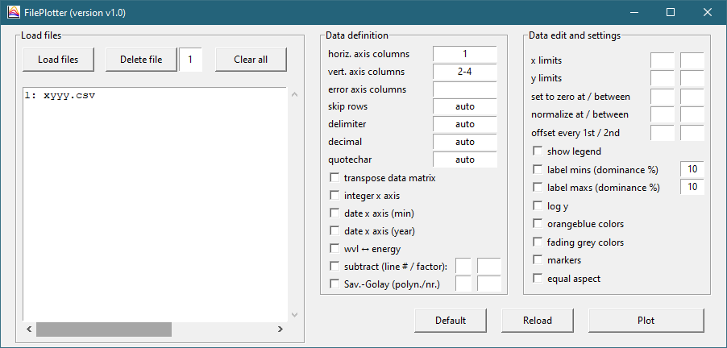

## FilePlotter 

Python GUI zum Plotten von Daten in Dateien.

### Start

**Mit Python**  
Für alle im Header von **FilePlotter.py** aufgeführten, benötigten Pakete, Prüfen ob sie in der Python Distribution installiert sind (`python -m pip show <package>` oder `python -m pip freeze`) und Installieren wenn nicht (`python -m pip install <package>==<version>`). Wenn alle Voraussetzungen erfüllt sind, mit `python FilePlotter.py` ausführen.

**Executable für Windows-Benutzer**  
Für Windows-Benutzer ist unter Releases eine ZIP-Datei mit kompiliertem Programm verfügbar. Herunterladen, Entzippen und **FilePlotter.exe** ausführen.

### Prozess
Im linken Bereich können Dateien geladen werden. Nach dem Laden werden sie angezeigt und einzelne können durch Eingabe der Nummer und `Delete File` wieder gelöscht werden. `Clear all` entfernt alle Dateien.  
Für die geladenen Dateien wird im mittleren Bereich definiert, wie der Inhalt der Dateien zu interpretieren ist. Das beinhaltet die Angabe der Spalten für die horizontale und die vertikale Achse, sowie die Trennzeichen der Datei. Im rechten Bereich wird die Anzeige (Limits etc.) definiert, und schließlich unter `Plot` die Grafik erzeugt.
Die Anzahl der Datenlinien in der Grafik ergibt sich aus der Anzahl der Dateien sowie der Anzahl der angegebenen Spalten.

### Einstellungen

**Spalten**  
In den drei Spalten-Felder für die horizontale (im folgenden x) und die vertikale (im folgenden y) Achse sowie die vertikalen (im folgenden ye) Fehlerbalken kann angegeben werden, welche Spalten der angegebenen Dateien zum Plotten verwendet werden sollen. Grundsätzlich erfolgt die Angabe durch komma-separierte Bereiche (bspw. `1,3,6-12`). Zusätzlich sind folgende Regeln implementiert:
- Wenn nur eine x-Spalte angegeben ist, dann überspringe diese Spalte in den y und ye-Spalten.
- Die ye-Spalten werden nur genau dann tatsächlich verwendet, wenn sie selbst zwei und die y-Spalte eine Spalte enthält.
- Gibt es gleich viele x-Spalten wie y-Spalten, werden sie paarweise verwendet. Ansonsten wird die erste x-Spalte für alle y-Spalten verwendet. Insbesondere kann also eine x-Spalte bei mehreren y-Spalten angegeben werden (klassisch für x Spalte `1`, für y Spalte `2-4`).
- Offene Bereiche (`2-` entspricht allen Spalten `>=2`)
- Alle Spalten durch Angabe von `A`/`ALL`/`ALLE`
- Alle ungeraden Spalten durch Angabe von `O`/`U`/`ODD`/`UNGERADE`
- Alle geraden Spalten durch Angabe von `E`/`G`/`EVEN`/`GERADE`

**CSV-Parsing**  
Unter den folgenden Feldern können alternativ zu `auto` benutzerdefinierte Zeichen angegeben werden. Beispiel: Eine Datenzeile der CSV sei folgendermaßen aufgebaut: `"1";"2.5"`
- `skip rows`: Wie viele Zeilen sollen übersprungen werden (Header), bevor die Daten gelesen werden?
- `delimiter`: Welches Zeichen trennt die Spalten? Beispiel: `;`
- `decimal`: Welches Zeichen trennt die Nachkommastellen? Beispiel: `.`
- `quotechar`: Welches Zeichen Klammert die Einträge? Beispiel: `"`

